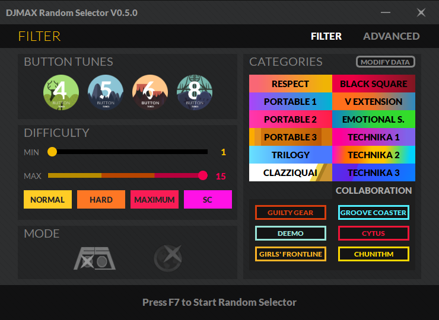

# DJMAX Random Selector

* This program is for DJMAX RESPECT V, selecting music randomly
* It uses keyboard macro so DO NOT run at other apps to prevent from eventualities
* [Download Link](https://github.com/wowvv0w/DJMAX_Random_Selector/releases)

## How to Use

1. Launch **Random.exe**
    1. If it is initial execution, Click **'MODIFY DATA'** button, Select your own DLCs and Click **'MODIFY'** button to edit your music list data.
    2. If you purchase new DLC, do it again to refresh.
2. Set filter as you want.
3. Press **F7**.
    1. You have to set several things for correct operation: **sort by title (A to Z)**, **'ALL TRACK' category**, **'KOREAN' language**
4. Enjoy.

## Functions

WIP

## Solve Known Issues

* Q. When DJMAX is running and I press F7, the screen freezes for a moment and then it just steps down once.
* A. I don't know why this sometimes happens, BUT I know a solution. Just restart program.

* Q. Antivirus software detected it as a virus.
* A. A few softwares might misdiagnose because of keyboard macro. So don't worry, it has no virus.

If there are any other issues, please tell me.

## UPDATE

[Link](https://github.com/wowvv0w/DJMAX_Random_Selector/blob/main/UPDATE.md)